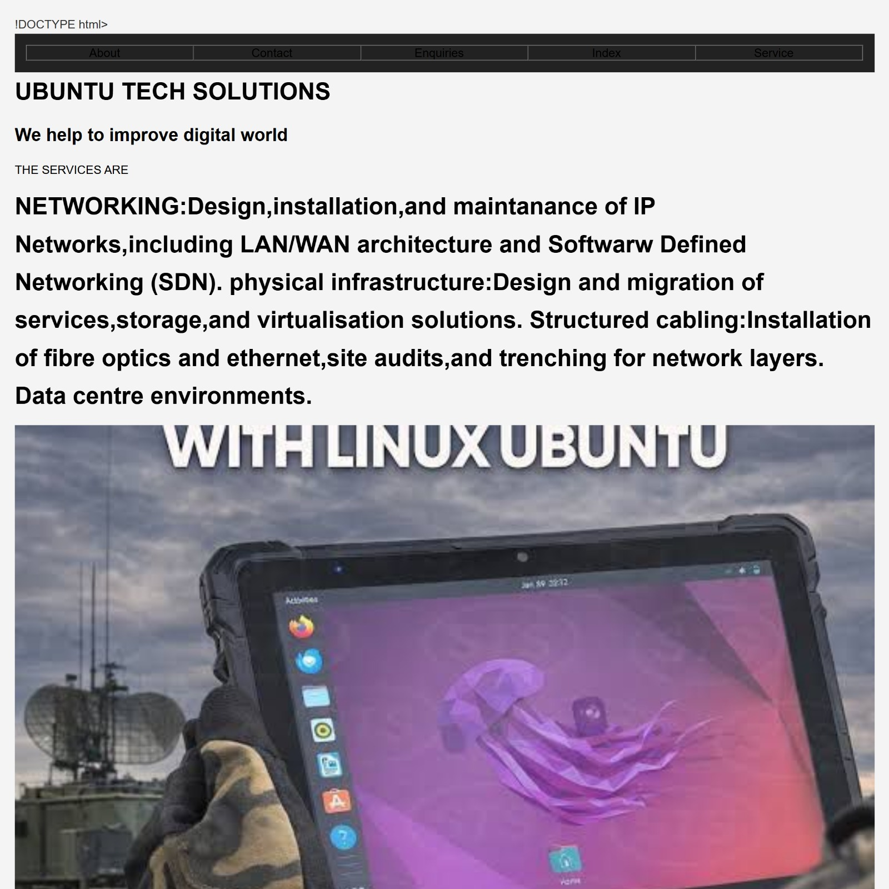
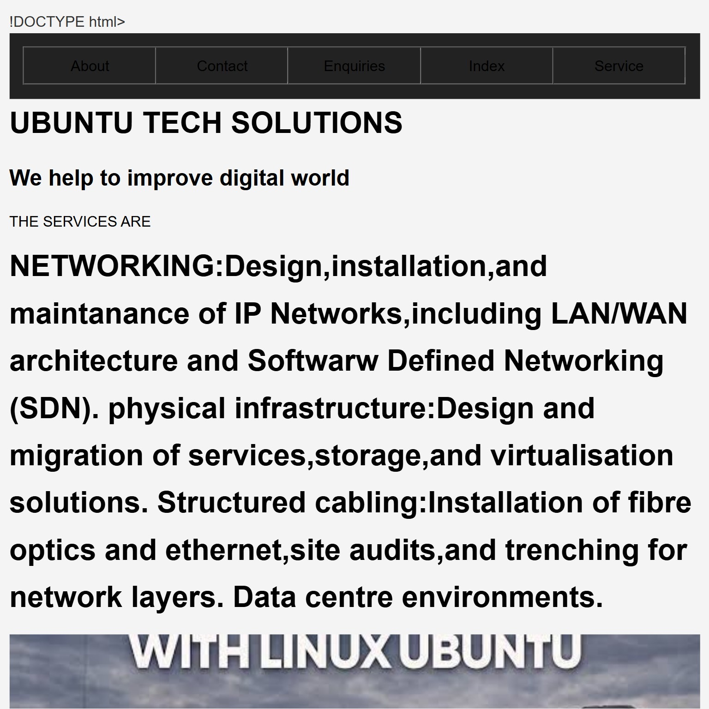
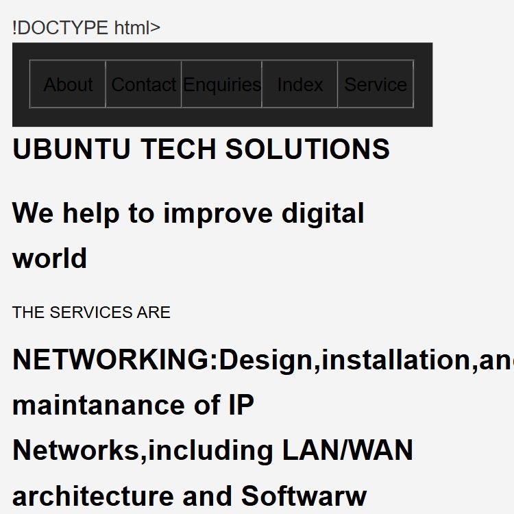

i# My Website screenshots
# Ubuntu Tech Solutions Website

A responsive website for Ubuntu Tech Solutions built with HTML and CSS for Wede 5020 Part 2. 
Features include responsive layouts, external stylesheet, and media queries for desktop, tablet, and mobile views.

## Changelog
- Created external `style.css` and linked it to all HTML pages
- Implemented responsive design using media queries for tablet and mobile breakpoints
- Changed layout to use CSS Grid and Flexbox for better structure
- Updated typography and spacing using relative units `rem` and `%`
- Added hover effects and improved visual

## References
- MDN Web Docs: https://developer.mozilla.org/en-US/docs/Web/CSS
- W3Schools: https://www.w3schools.com/css/
- [Add any other sites you used]

## My Website Screenshots

